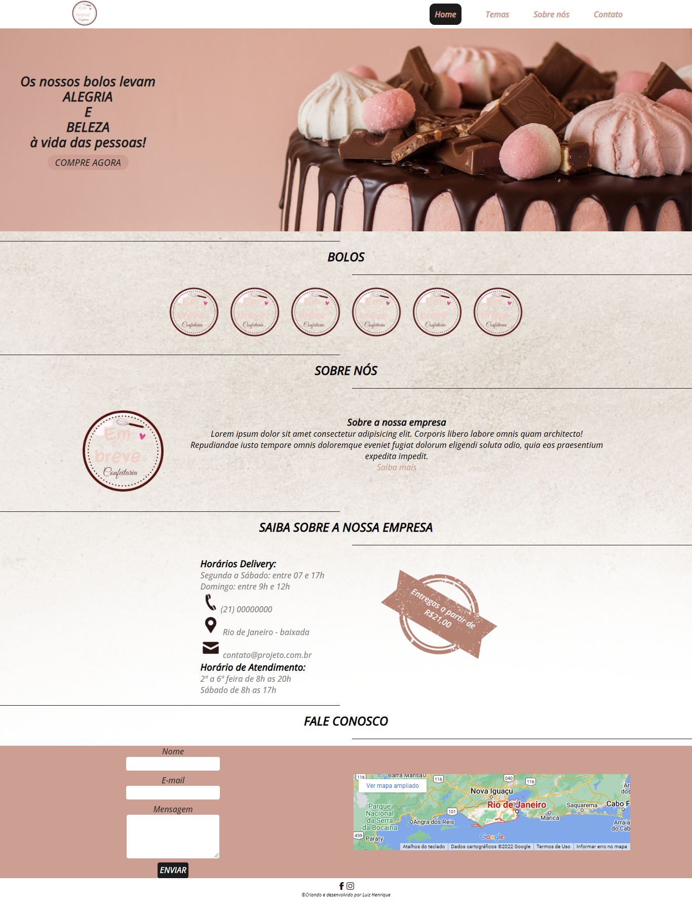

# Layout de Confeitaria

>Layout totalmente rensponsivo.
Projeto construido inspirado em um template de confeitaria.
[🔗Clique aqui para acessar](https://luizhenr1que.github.io/Confeitaria/)

## 🛠 Tecnologias
- HTML
- CSS
- JavaScript
- Git e Github

## 😁 O que aprendi 
Nesse layout eu preferi deixar o framework bootstrap de lado e focar apenas em css, ultilizando flexbox e media queries.
Também aprendi um pouco mais de JavaScript. 
## 🤍 Contato
luizhenriquejob4@gmail.com 